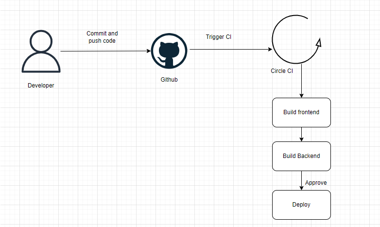

# Pipeline

## GitHub

The developers commit and push their code to the GitHub repository which is linked to the CircleCI platform. GitHub triggers the CircleCI platform when code is pushed to the repository.

## Prepare CircleCI environment variables

Setup all the environment variable needed to configure

### Steps of CircleCI Build

- Spin up enviorment
- Prepare environment variables
- Install Nodejs 14.15
- Install AWS CLI
- Configure AWS Access Key ID
- Setting up Elastic Beanstalk
- Checkout Code
- Install Front-End dependencies
- Install API Dependencies
- Front-End lint
- Front-End build
- API Build

### Hold

Hold the build of `main` branch to get approval. After the build is approved, run deploy job.

### Steps of CircleCI Deploy

- Spin up enviorment
- Prepare environment variables
- Install Nodejs 14.15
- Install AWS CLI
- Configure AWS Access Key ID
- Setting up Elastic Beanstalk
- Deploy App

